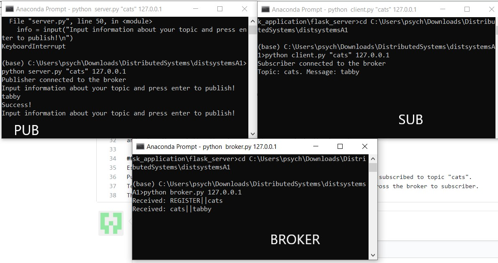
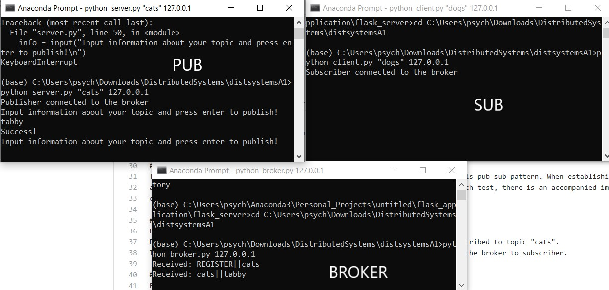
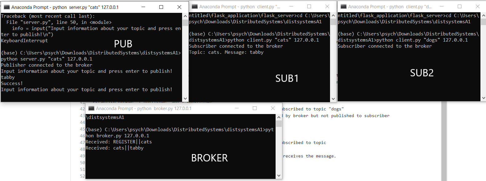
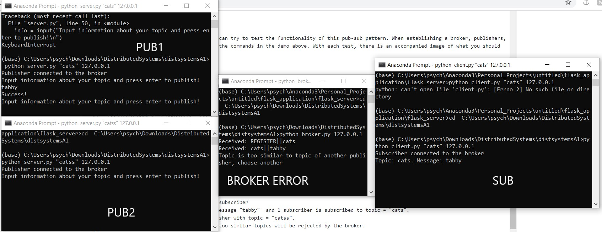
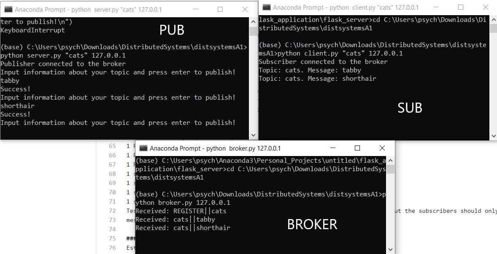
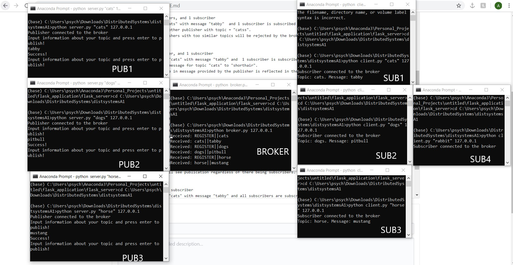
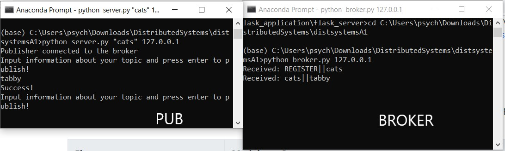
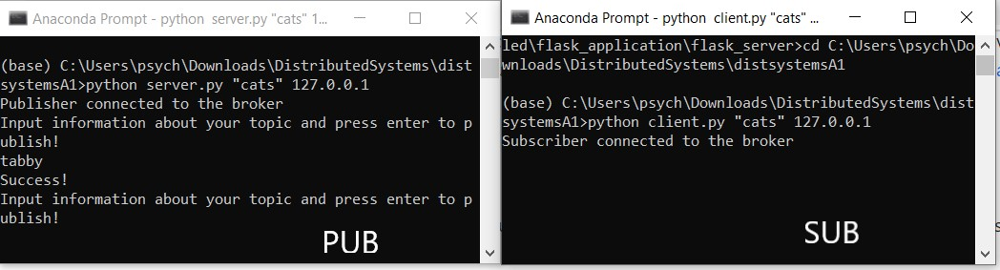
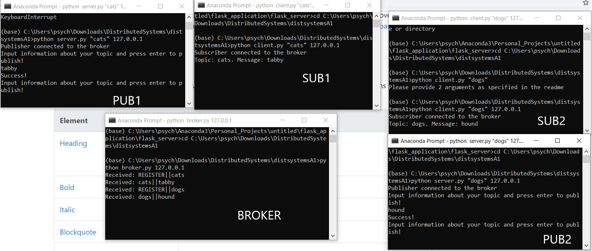

# Assignment 1 for distributed systems
The following assignment covers the pub-sub pattern with a single broker using ZMQ and mininet.

You can configure python yourself, or download Python 3.6.10 and install the packages from the requirements.txt (it has a lot of extra stuff in it as well) file provided

## Simple Demo and Getting Started
First, install mininet and ZMQ on a virtual machine (VirtualBox works well).
Then clone this github repository into a local folder on the VM.

Begin by creating a mininet topology with any number of hosts in the assignment directory. 
For instance, you can run the following command 
*sudo python mr_mininet.py -p 5556 -M 3 -R 3 -r 2 big.txt*

This will create a topology of 7 hosts. We will only need three of them.
Xterm into three of these hosts, creating new terminal windows for each. 
We establish one of these hosts as the broker. In the first xterm window issue the following command:
*python broker.py 10.0.0.1* 

We establish another host as a subsciber. In a second xterm window issue the following command:
*python client.py "sports" 10.0.0.1*
This creates a subscriber subscribed to the topic of "sports"

We estalbish the third host as a publisher. In a third xterm window issue the following command:
*python server.py "sports" 10.0.0.1*
This will register the publisher with the broker. Now we are prompted to give the message associated with the topic "sports". We can enter "cool" for instance.

Now we will see in the broker xterm window and the subscriber xterm window the topic that the publisher is associated with along with the message "cool". This demonstrates the correct information propagation from publisher to broker to subsciber.

You should see the following results below:

## Unit Tests
The following are unit tests that you can try to test the functionality of this pub-sub pattern. When establishing a broker, publishers,
and subscribers, follow the steps and the commands in the demo above. With each test, there is an accompanied image of what you should
expect to see.

### Test 1
Establish broker, 1 publisher, and 1 subscriber
Publisher provides topic = "cats" with message "tabby" and subscriber is subscribed to topic "cats".
Test ensures that the topic/message provided by the publisher travels across the broker to subscriber.

### Test 2 
Establish broker, 1 publisher, and 1 subscriber
Publisher provides topic = "cats" with message "tabby" and subscriber is subscribed to topic "dogs"
Test ensures that the topic/message provided by the publisher is recognized by broker but not published to subscriber

### Test 3
Establish broker, 1 publisher, and 2 subscribers
Publisher provides topic "cats" with message "tabby" and 1 subscriber is subscribed to topic 
"cats" and 1 subscriber is subscribed to topic "dogs".
Test ensures that the subscriber subscribed to "cats" is the only one that receives the message.

### Test 4
Establish broker, 2 publishers, and 1 subscriber
Publisher provides topic "cats" with message "tabby"  and 1 subscriber is subscribed to topic = "cats".
We then try to establish another publisher with topic = "catss".
Test ensures that the publishers with too similar topics will be rejected by the broker.

### Test 5
Establish broker, 1 publisher, and 1 subscriber
Publisher provides topic = "cats" with message "tabby" and  1 subscriber is subscribed to topic "cats".
Publisher then changes the message for topic "cats" to "shorthair".
Test ensures that the change in message provided by the publisher is reflected in the subscriber to "cats".

### Test 6
Establish broker, 3 publishers, and 4 subscribers
1 Publisher provides topic = "cats" with message "tabby" 
1 Publisher provides topic = "dogs" with message "pitbull" 
1 Publisher provides topic = "horse" with message "mustang" 
1 subscriber is subscribed to topic = "cats"
1 subscriber is subscribed to topic = "dogs"
1 subscriber is subscribed to topic = "horse"
1 subscriber is subscribed to topic = "rabbit"
Test ensures that the change the broker should see all of the publications, but the subscribers should only see
messages corresponding to their topics.

### Test 7
Establish broker and 1 publisher
Publisher provides topic = "cats" with message "tabby" 
Test ensures that broker will see publication regardless of there being subscribers.

### Test 8
Establish 1 publisher and 1 subscriber
Publisher provides topic = "cats" with message "tabby" and all subscribers are subscribed to topic "cats"
Test ensures that there is no message transfer due to lack of broker.

### Test 9 
Establish 1 broker, 1 publisher, and 1 subscriber.
Publisher provides topic = "cats" with message "tabby" and all subscribers are subscribed to topic "cats"
After message is seen to subscriber, create another publisher with topic = "dogs" and message "hound" with corresponding
subscriber topic = "dogs".
This test ensures that publishers and subscribers can be added during anytime in the process.

## Measurements
In the main method of measurements.py, comment out whichever measurement test you would like to run in order to receive the results. If any exceptions are thrown, the results will likely be printed out before the exceptions are thrown.

Our raw collected measurements are in the measurements excel files, and our graphs (with explanations) are in the Measurements docx file
