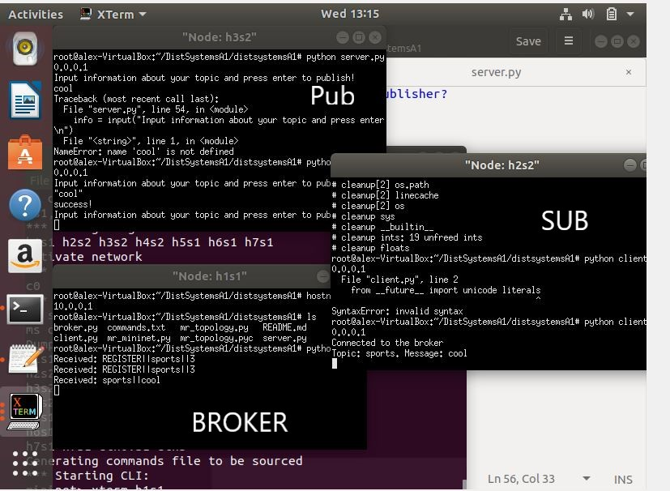

# Assignment 1 for distributed systems
The following assignment covers the pub-sub pattern with a single broker using ZMQ and mininet.

## Simple Demo and Getting Started
First, install mininet and ZMQ on a virtual machine (VirtualBox works well).
Then clone this github repository into a local folder on the VM.

Begin by creating a mininet topology with any number of hosts in the assignment directory. 
For instance, you can run the following command 
*sudo python mr_mininet.py -p 5556 -M 3 -R 3 -r 2 big.txt*

This will create a topology of 7 hosts. We will only need three of them.
Xterm into three of these hosts, creating new terminal windows for each. 
We establish one of these hosts as the broker. In the first xterm window issue the following command:
*python broker.py 10.0.0.1* 

We establish another host as a subsciber. In a second xterm window issue the following command:
*python client.py "sports" 10.0.0.1*
This creates a subscriber subscribed to the topic of "sports"

We estalbish the third host as a publisher. In a third xterm window issue the following command:
*python server.py "sports" 10.0.0.1*
This will register the publisher with the broker. Now we are prompted to give the message associated with the topic "sports". We can enter "cool" for instance.

Now we will see in the broker xterm window and the subscriber xterm window the topic that the publisher is associated with along with the message "cool". This demonstrates the correct information propagation from publisher to broker to subsciber.

You should see the following results below:

